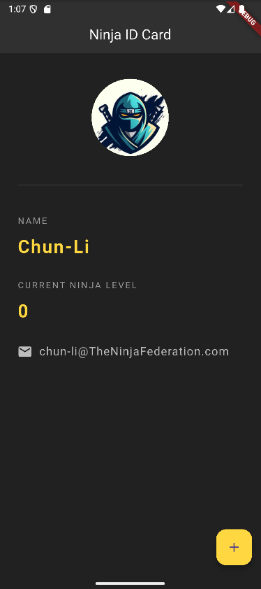

# 🥷 Ninja ID Card - Flutter App

A simple and elegant Flutter application that displays a **Ninja ID Card** with a tappable floating action button that increases the ninja's level.

## 📱 Preview


---

## 🚀 Features

- Displays a ninja-themed ID card with:
    - Profile picture
    - Name
    - Dynamic "Ninja Level"
    - Email contact
- `+` button increments the ninja level using Flutter’s `StatefulWidget`.

---

## 🛠️ Tech Stack

- **Flutter** (Dart)
- **Material Design Components**

---

## 📂 File Structure

```bash
ninja_id_card/
├── assets/
│   └── ninja.jpg         # Avatar image used in the app
├── lib/
│   └── main.dart         # Main Dart file (this project)
├── pubspec.yaml          # Flutter configuration and asset linking
└── README.md             # This file
```

## How to Run

- Clone the repo(or copy the main.dart to a flutter project)
```bash
git clone <your-repo-url>
cd ninja_id_card
```
- Run the app
```bash
flutter pub get
flutter run
```